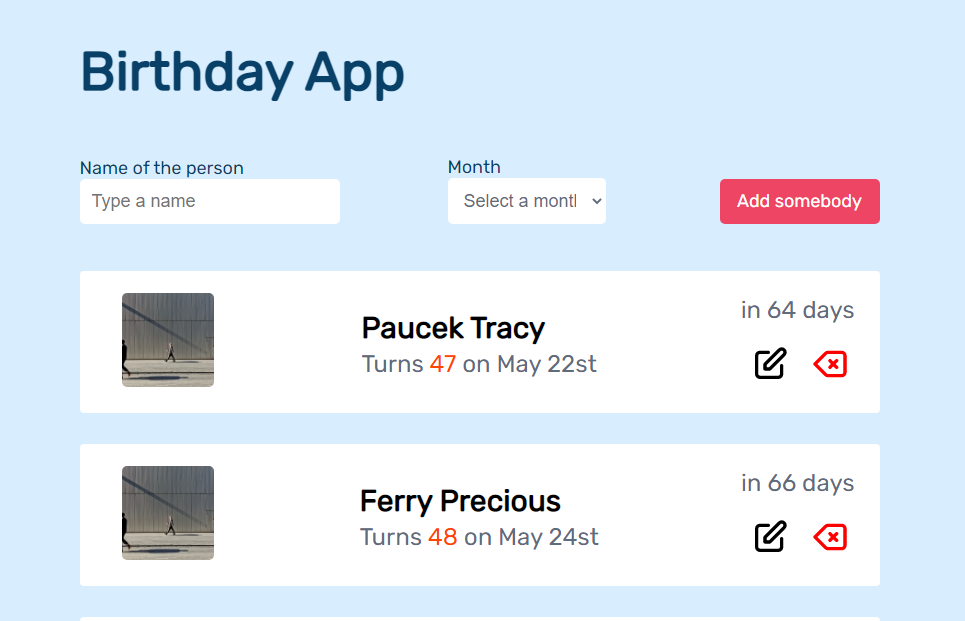
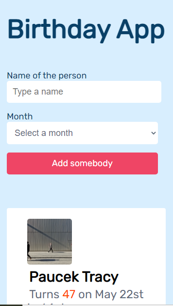

# **BIRTHDAY APP**

<h1 align="center">Birthday-App</h1>

  <h3>
    <a href="https://github.com/Tanosimboangy/birthday-app">
      Solution
    </a>
     | 
    <a href="https://birthday-app-jacquit.netlify.app/">
      Demo
    </a>
  </h3>

## This project is only built using javascript and html with css

# **You can find the demo of this project here:** 

  - If you want to find the demo about this project, you can click this demo link: 

<a href="https://birthday-app-jacquit.netlify.app/">Demo</a>
.

  - This is from Netlify but if you want to look at the solution here is the link: 

<a href="https://github.com/Tanosimboangy/birthday-app">Github</a>
.

  - This is the design for this Birthday App: 

<a href="https://www.figma.com/file/bb1Mie5R3mUhR77PtGG8bJ/Birthday-App?node-id=0%3A1">Figma</a>
.

#   **My experience:**

    -  Since this project is based upon Javascript, displaying each item can be complicated.

    - After fetching the data from the json file, I displayed the them and translated all of the numeric number into readable date.

    - I mirrored and stored all the data into the local storage, this is quite useful so that you do not need to fetch everytime.

    - Apart from that, I created a function called `destryoPopup`, which is responsible for removing the class open.

    - After all, I have this `editFunction` which is in charge of handling all the edits the user is doing.

    - Then, the delete fuction, in which I managed to delete one of the items. By clicking the delete icon, you can delete one items from the lists.

    - On top of that, I have a form in which you can add a new list of a person. Just click the add somebody button and the form will appear so that you can add the details for the new person.

#   **In a few sentences, explain the structure of my project:**
    - Lately, I tried to use parcel to run the run this code to the browser.

    - There are one input which you can filter the lists by typing the name of the person. The select can help you to search a specific person according to its birthday date, the month.

    - You can click the `Add Somebody` button so that you can add a new person into the lists.

    - In each item, we can see two icons: the edit icon, which you can click in order to edit the information about the person on that specific list. There is also a delete icon that you can click in order to remove one person from the lists.

## Anything new I learn while working on this project:
    - I learn to use another strategy to get the date from using the number. I tried to use date.fns and it worked. 

## The most challenging part for me were:
    - I had a lot of difficulty while trying to translate the number into dates, especially with using this library called `date.fns`.

    - I also spent most of my time to handle the form.

    - I struggled a lot when I stored all of the data into Local Storage